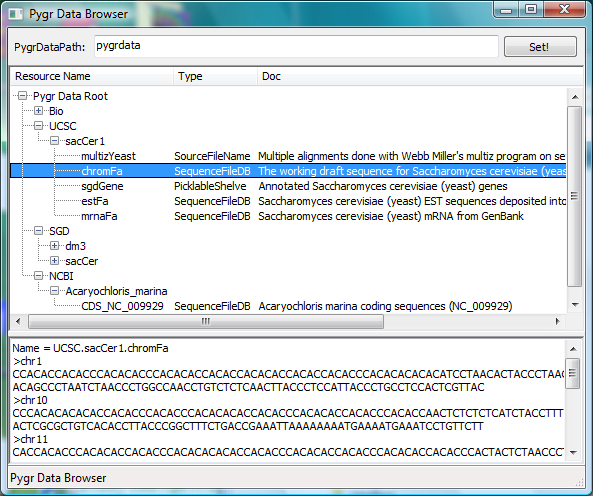

=================
Pygr Data Browser
=================

The DataBrowser is a graphical user interface that displays the current content of 
the ``pygr.Data`` path. Moreover selecting a given resource allows one to `peek` 
at its content by displaying the first one hundred or so entries in a shortened format 
(lower pane). 

.. note::
    Running this module requires 
    `wxPython <http://www.wxpython.org/>`_ 

